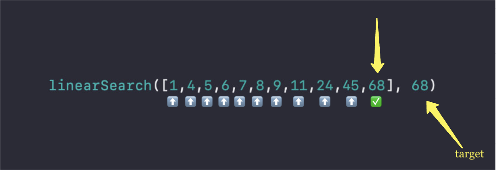
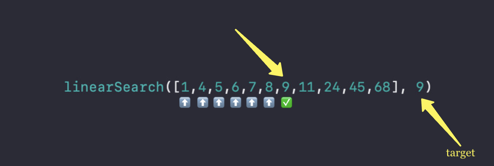
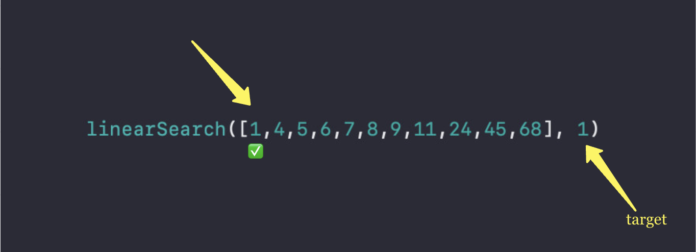

# Why Big O Notation?


Let’s dive into what’s Big O Notation when talking about algorithms, efficiency and performance, and why should we care about it?

Let’s start with talking about the two types of performance measurements 

### Time Complexity

Measures how much time an algorithm takes to run.

### Space Complexity

Measure how much memory (or storage) an algorithm uses.

# How Time Complexity is measured

First, we’ll measure the time complexity for this simple search function.

The function looks for a `target` in an `array` , and performs a linear search, that means that is going through every element of the `array` until it finds the `target` . So, let’s take our input size`n` to measure these aspects.

```swift
func linearSearch(_ array: [Int], _ target: Int) -> Bool {
    for number in array {
        if number == target {
            return true
        }
    }
    return false
}
```

In this case we do care how big is the `array` because in the worst case scenario, the `target` that we need to find is at the last position of the `array` 

### Worst case scenario



Our function took every element and compare it to the target, to see if that’s the one the we are looking for, and happened that our target was found in the last position of the `array` . If we have `n` as the size of the `array` , our function took `O(n)`(linear time) in process all elements of the array.

### Some other scenario



Our function just spent 7 iterations to find the target in our array, even though it is almost the half of the size (n/2), we talk about constants when describing Big O Notation, we can categorize this as `O(n)` .

### Best case scenario



In this case the iterations it took to find our `target` was just one, for a linear search the Big O Notation best case scenario would be `O(1)` 

| Scenario | Description | Time Complexity |
| --- | --- | --- |
| Best Case | Target was found at the first element | O(1) |
| Average Case | Target is found somewhere in the middle | O(n) |
| Worst Case | Target is not in the array or is the last item | O(n) |

Why then we say that a linear search is `O(n)` , because when we talk about Big O Notation, we always concerned about the worst case scenario, it defines how bad it could get as the input grows. 

<aside>
💡

**Algorithms**

We just saw one famous algorithm, **linear search** , there are other types of search algorithms, like the **binary search**, which have a Big O Notation of `O(log n)` which is faster than **linear search** because of how is the approach to find the target in an array, but we’ll talk about it in other article.

</aside>

# Big O Categories

Here are the common complexities in algorithms, I’m going to give you an example of each one.

| Big O | Name | Description |
| --- | --- | --- |
| **O(1)** | Constant Time | Always takes the same amount of time, no matter the input size. |
| **O(log n)** | Logarithmic Time | Cuts the problem size in half at each step. |
| **O(n)** | Linear Time | Time grows directly proportional to the size of the input. |
| **O(n log n)** | Linearithmic Time | Time grows slightly faster than O(n); common in sorting algorithms. |
| **O(n²)** | Quadratic Time | Time grows as the square of the input; common with nested loops. |
| **O(2ⁿ)** | Exponential Time | Time doubles with every additional input; usually from recursion. |
| **O(n!)** | Factorial Time | Time explodes; common in combinatorics problems. |

## Examples

### O(1) Constant Time

The runtime doesn’t depend on the size of the input, it doesn’t matter if the array has thousands of elements or just ten elements, it will keep the same runtime.

```swift
func getFirstElement(from array: [Int]) -> Int? {
    return array.first // Always takes the same amount of time to return the value
}
```

### O(n) Linear time

The runtime grows proportionally with the size of the input, usually evaluates each element in the array.

```swift
func findElement(in array: [Int], target: Int) -> Bool {
    for number in array { // Checks each element one by one.
        if number == target {
            return true
        }
    }
    return false
}
```

### O(log n) Logarithmic time

The runtime grows more slowly as the input size increases since the algorithm halves the problem at each step. 

```swift
func binarySearch(in sortedArray: [Int], target: Int) -> Bool {
    var low = 0
    var high = sortedArray.count - 1

    while low <= high {
        let mid = (low + high) / 2
        if sortedArray[mid] == target {
            return true
        } else if sortedArray[mid] < target {
            low = mid + 1
        } else {
            high = mid - 1
        }
    }
    return false
}
```

### O(n log n) Linearithmic Time

Commonly found in **Divide and conquer** algorithms.

```swift
func mergeSort(_ array: [Int]) -> [Int] {
    guard array.count > 1 else { return array } // Base case

    let middle = array.count / 2
    let left = mergeSort(Array(array[..<middle]))
    let right = mergeSort(Array(array[middle...]))

    return merge(left, right)
}

func merge(_ left: [Int], _ right: [Int]) -> [Int] {
    var result: [Int] = []
    var leftIndex = 0, rightIndex = 0

    while leftIndex < left.count && rightIndex < right.count {
        if left[leftIndex] < right[rightIndex] {
            result.append(left[leftIndex])
            leftIndex += 1
        } else {
            result.append(right[rightIndex])
            rightIndex += 1
        }
    }
    return result + left[leftIndex...] + right[rightIndex...]
}
```

### **O(n²) Quadratic Time**

The runtime increases quadratically with the input size, typically due to **nested loops**.

```swift
func printAllPairs(from array: [Int]) {
    for i in 0..<array.count {
        for j in 0..<array.count {
            print("(\(array[i]), \(array[j]))") // Prints every pair of elements.
        }
    }
}
```

### **O(2ⁿ) Exponential Time**

The runtime doubles each time the input increases by one. This commonly occurs in recursive functions that lack optimization.

```swift
func fibonacci(_ n: Int) -> Int {
    if n <= 1 {
        return n
    }
    return fibonacci(n - 1) + fibonacci(n - 2)
}
```

### **O(n!): Factorial Time**

The runtime grows astronomically. Rare but appears in **permutations** and **combinatorics** problems.

```swift
func permutations(of list: [Int]) -> [[Int]] {
    guard list.count > 0 else { return [[]] }
    var result: [[Int]] = []

    for i in 0..<list.count {
        let remaining = Array(list[..<i] + list[(i+1)...])
        let subPermutations = permutations(of: remaining)
        for perm in subPermutations {
            result.append([list[i]] + perm)
        }
    }
    return result
}
```

# Some tips on how to identify Big O
- **Count Loops**: A single loop typically means O(n), while nested loops result in O(n²).
- **Divide and Conquer**: When an algorithm repeatedly splits data in half, it typically results in O(log n).
- **Recursion**: Count the number of recursive calls made, which often results in O(2ⁿ) or similar complexity.

# Why is it important and why should I care?

When writing code and algorithms in our daily work, we must always strive for efficiency.

It is critical for an app to handle time and memory when dealing with users and data.

It is going to help you to avoid performance bottlenecks as the data in your application grows.

I personally practice algorithms in webs like [LeetCode](https://leetcode.com/) or [HackerRank](https://www.hackerrank.com/). This will help you practice and be ready for life and tech interviews.
